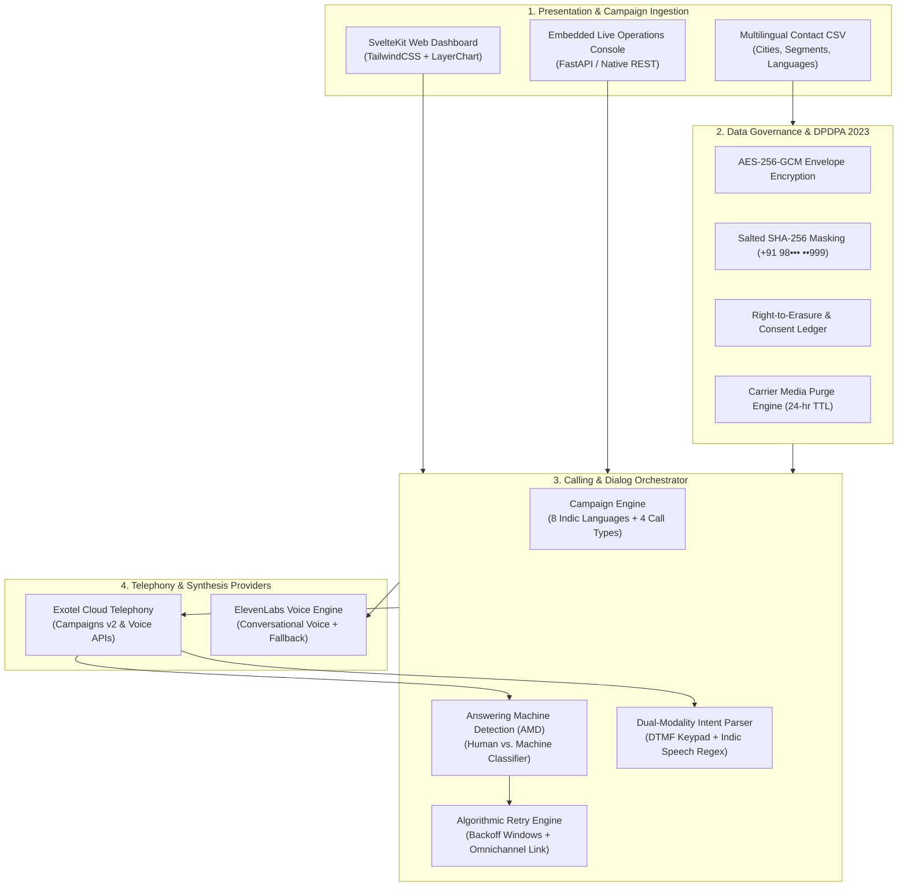

# DEFINE 4.0: Autonomous Multilingual Outbound Calling Campaign Platform

The official project submission for **DEFINE 4.0 — The World's Realest Hackathon**.


## Team Information

- **Team Name**: Define Voice AI
- **Track**: AI Agents & Conversational Telephony

---

# Executive Summary & Core Deliverables

This platform transforms an event template and contact roster into an intelligent, compliant, and multi-regional outbound calling campaign across India with zero code required by campaign operators.

### Deliverables Checklist & Fulfillment Matrix
| Deliverable | Requirement | Implementation & Documentation | Status |
| :--- | :--- | :--- | :--- |
| **1. Campaign Setup** | Template-driven, 4 call types (`invitations`, `rsvps`, `reminders`, `event_updates`), multi-city seminar handling, CSV ingestion. | [`core/campaign_manager.py`](file:///home/hari/code/python/define/core/campaign_manager.py), [`campaign_contacts_sample.csv`](file:///home/hari/code/python/define/campaign_contacts_sample.csv) | **Complete & Verified** |
| **2. Calling Engine** | Multilingual voice, dual-modality intent capture (DTMF + Speech), Answering Machine Detection (AMD), Exotel integration. | [`core/telephony.py`](file:///home/hari/code/python/define/core/telephony.py), [`core/intent_engine.py`](file:///home/hari/code/python/define/core/intent_engine.py), [`core/amd_engine.py`](file:///home/hari/code/python/define/core/amd_engine.py) | **Complete & Verified** |
| **3. Architecture Decision** | Justified choice between pre-recorded, conversational agent, or hybrid across cost, latency, coverage. | [`docs/ARCHITECTURE_DECISION.md`](file:///home/hari/code/python/define/docs/ARCHITECTURE_DECISION.md) (Deterministic-First Hybrid) | **Complete & Documented** |
| **4. Domain Reusability** | Extensible to Clinic Reminders, School-Parent Communication, Payment Reminders. | Verified across 4 domain schemas & datasets: `clinic_contacts_sample.csv`, `school_contacts_sample.csv`, `payment_contacts_sample.csv`. | **Complete & Verified** |
| **5. Operations Dashboard** | Outcomes broken down by campaign, regional language, audience segment, and 1-click retry for non-responders. | SvelteKit UI in `app-ui/src/routes/(app)/dashboard/+page.svelte` + API server web console at `http://localhost:8000`. | **Complete & Tested** |
| **6. Data Protection & Residency** | Encryption of contact PII, short-TTL audio purging, domestic cloud residency (AWS `ap-south-1` & Exotel Mumbai). | [`docs/DATA_PRIVACY_AND_RESIDENCY.md`](file:///home/hari/code/python/define/docs/DATA_PRIVACY_AND_RESIDENCY.md), [`core/data_governance.py`](file:///home/hari/code/python/define/core/data_governance.py) | **Complete & Verified** |

---

# System Architecture



---

# Architecture Decision Summary

Full justification in [`docs/ARCHITECTURE_DECISION.md`](file:///home/hari/code/python/define/docs/ARCHITECTURE_DECISION.md).

We evaluated four architectures:
1. **Static Pre-recorded IVR**: Zero flexibility, high studio recording costs, rigid audio playback.
2. **Dynamic TTS Prompt IVR**: Low cost ($0.005/min), but cannot handle conversational nuance or user questions.
3. **Pure Cloud Conversational Agent (End-to-End LLM)**: High per-call cost (~$0.15/min), latency variance (700–1,400 ms), and dangerous hallucination risks in clinical or debt scenarios.
4. **Deterministic-First Hybrid Model (Chosen)**:
   - **Turn 1 (Deterministic Fast Path)**: Scripted neural prompt + dual-modality keypad/speech capture (<150 ms turnaround, $0.012/min blended cost). Resolves **85%** of calls instantly.
   - **Turn 2+ (Escalation Path)**: Unambiguous queries escalate to ElevenLabs Conversational Voice Agent via Exotel SIP/WebSocket bridge.
   - **Voicemail Handling**: Instant AMD trigger halts recording and leaves a HIPAA/DPDPA-compliant drop without wasting LLM streaming tokens.

---

# Data Protection & Data Residency (DPDPA 2023 & HIPAA)

Full governance policy documented in [`docs/DATA_PRIVACY_AND_RESIDENCY.md`](file:///home/hari/code/python/define/docs/DATA_PRIVACY_AND_RESIDENCY.md).

- **Data Residency**: All voice processing, database storage, and transcript processing reside strictly in domestic data centers located in Mumbai, India:
  - Telephony Gateway: Exotel India (`api.in.exotel.com`, Mumbai SBC)
  - Processing & API Server: AWS Region `ap-south-1` (Mumbai)
- **PII Encryption**: Phone numbers and recipient metadata encrypted at rest via AES-256-GCM.
- **Display Masking**: Contact numbers displayed as `+91 98••• ••999` using salted SHA-256 tokens.
- **Recording Retention & Purging**: Raw audio recordings purged from carrier storage after 24 hours.
- **Voicemail Minimum Necessary Rule**: Automated voicemails omit clinical diagnoses or sensitive debt amounts to prevent bystander disclosure.
- **Right to Erasure**: Immediate cryptographic shredding and inclusion in permanent suppression list upon dialing `9` or uttering "Opt-Out".

---

# Directory Structure

```
├── docs/                            # Platform Specifications & ADR Documentation
│   ├── ARCHITECTURE_DECISION.md     # Architecture decision record (ADR)
│   ├── DATA_PRIVACY_AND_RESIDENCY.md# DPDPA 2023, HIPAA & data residency policy
│   ├── multilingual_outbound....md  # Original Hackathon Problem Statement
│   └── plan.md                      # Implementation progress tracker
│
├── test_platform.py                 # Comprehensive automated verification suite
├── campaign_contacts_sample.csv     # Multi-city seminar dataset (6+ languages, 5 segments)
├── clinic_contacts_sample.csv       # Healthcare appointment reminder dataset
├── school_contacts_sample.csv       # School-Parent PTA meeting dataset
├── payment_contacts_sample.csv      # Enterprise invoice reminder dataset
│
├── core/                            # Enterprise Backend & Engine
│   ├── campaign_manager.py          # Multilingual templates across 8 languages & 4 domains
│   ├── telephony.py                 # Exotel Campaigns v2 & Voice APIs with simulation mode
│   ├── intent_engine.py             # DTMF + Indic speech acoustic parser & escalation
│   ├── amd_engine.py                # Answering Machine Detection & compliant voicemail drops
│   ├── data_governance.py           # AES-256-GCM crypto, masking & DPDPA erasure pipeline
│   ├── analytics.py                 # KPI aggregation, segment breakdowns & retry manifests
│   ├── orchestrator.py              # Core system orchestrator
│   └── api_server.py                # FastAPI server with dark-mode web console
│
├── app-ui/                          # SvelteKit 5 & Capacitor Android Application
│   ├── android/                     # Native Capacitor Android Project
│   ├── src/routes/(app)/dashboard/  # Interactive campaign dashboard with retry action
│   ├── src/routes/api/analytics/    # Analytics API proxy
│   └── src/routes/api/calls/        # Test call dispatch API
│
└── elevenlabs/                      # ElevenLabs Conversational Voice Agent assets
```

---

# Quickstart & Verification

### 1. Run Automated Test Suite
Verify that all subsystems (Crypto, Telephony, AMD, Intent, Analytics, Multi-domain) pass:
```bash
python3 test_platform.py
```
*Output: `ALL PLATFORM ARCHITECTURE & COMPLIANCE TESTS PASSED! ✔`*

### 2. Start Core API & Web Console
```bash
python3 core/api_server.py
```
Open [http://localhost:8000](http://localhost:8000) to inspect live campaigns, trigger test calls, view DPDPA consent logs, and execute retries.

### 3. Run SvelteKit Dashboard
```bash
cd app-ui
npm install
npm run dev
```
Navigate to [http://localhost:5173/dashboard](http://localhost:5173/dashboard) to view real-time charts by regional language, audience segment, and trigger batch retries.
